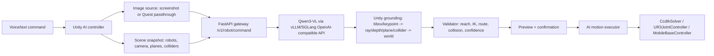

# MR VLM Digital-Twin Robot Control Plan

## Summary

Build a digital-twin-only VLM control pipeline for UR3, KUKA KR600, and Scout V2. The v1 architecture is modular: server-side Qwen3-VL handles language, visual reference, and task intent; Unity owns metric 3D grounding, validation, preview, and execution. ReKep/VoxPoser-style keypoint constraints become the v2 research core, not the first prototype dependency.

Confidence:

- High: screenshot mode, typed server plan, Unity-side preview/validation/execution.
- Medium: Quest passthrough camera grounding; requires a device spike.
- Low for v1: full on-device Qwen3-VL in Sentis. Use Sentis only for smaller ASR/detection/segmentation models.

## Current Implementation Status

Implemented in this repository:

- Unity AI controller and world-space panel: text command, `SEND`, `REC`,
  `SOURCE`, `CONFIRM`, `CANCEL`.
- Unity local mock path for testing without a server.
- Screenshot image capture path and guarded Quest-passthrough fallback path.
- Scene snapshot builder for placed robots, camera matrices, MR planes, and
  known scene objects.
- Multipart Unity client with image and optional WAV audio upload.
- Unity-side grounding, validation, preview, and confirmed execution scaffold.
- FastAPI robot-AI gateway with mock mode and OpenAI-compatible forwarding.
- Optional server-side ASR forwarding to an OpenAI-compatible
  `/audio/transcriptions` endpoint.
- Quest speech plumbing: microphone WAV recorder, Android `TextToSpeech`,
  selected Whisper tiny.en Sentis ASR bundle, PCM16 WAV decoder, and greedy
  Sentis Whisper decoder loop.
- EditMode tests for schema helpers, validation helpers, WAV encode/decode, and
  selected speech bundle metadata.

Not yet validated:

- Unity compile after Package Manager resolves `com.unity.ai.inference`.
- Actual Quest 3/3S Sentis Whisper inference with exported model assets.
- Real Meta Passthrough Camera API frame access.
- Real Qwen3-VL/vLLM/SGLang server response quality.
- Collision validation beyond the current basic gates.

Operational setup and validation instructions are in
`docs/unity_ai_robot_control_setup_guide.md`.

## Research Basis

- ReKep: use 3D keypoints and relational constraints as the research-aligned intermediate representation, but defer full optimization to v2: <https://rekep-robot.github.io/>, <https://arxiv.org/abs/2409.01652>.
- VoxPoser: supports later 3D affordance/value-map planning for dense 6-DoF trajectories: <https://voxposer.github.io/>.
- VR-DAgger: relevant for VR correction/data collection and evaluation, not direct v1 VLM planning: <https://arxiv.org/abs/2605.27114>.
- OK-Robot: validates modular perception/navigation/manipulation integration and failure analysis: <https://ok-robot.github.io/>.
- RoboPoint/Qwen3-VL-Seg: motivate keypoint/segmentation upgrades beyond boxes: <https://arxiv.org/abs/2406.10721>, <https://arxiv.org/abs/2605.07141>.
- Unity/Meta: Sentis 2.6 supports ONNX/LiteRT/exported PyTorch but must be profiled per model; Quest passthrough camera is Quest 3/3S device-only and permission-gated: <https://docs.unity3d.com/Packages/com.unity.ai.inference@2.6/manual/index.html>, <https://developers.meta.com/horizon/documentation/unity/unity-pca-overview/>, <https://developers.meta.com/horizon/documentation/unity/unity-depthapi-overview/>.

## Architecture



FastAPI is a thin robot gateway, not the model runtime. vLLM/SGLang should load Qwen3-VL on the RTX 4090 server and expose an OpenAI-compatible API. The gateway keeps Unity stable while model serving changes.

## Key Interfaces

Unity AI subsystem lives under `Assets/Scripts/AI/`:

- `RobotAiController`: user entry point, command state machine, confirm/cancel.
- `AiSceneSnapshotBuilder`: enumerates placed robots, robot transforms, TCP, reach, Scout pose, camera matrices, and MR planes.
- `AiImageCaptureProvider`: interface with `UnityScreenshotCaptureProvider` and a guarded `QuestPassthroughCaptureProvider`.
- `AiCommandClient`: posts multipart requests and parses typed JSON.
- `AiGroundingService`: lifts bboxes/keypoints into Unity world coordinates.
- `AiPlanValidator`: local safety and feasibility checks.
- `AiPlanPreview`: target markers and planned path/route.
- `AiMotionExecutor`: executes confirmed plans without calling private `WaypointController` methods.

Server scaffold lives under `server/robot_ai/`:

- `main.py`: FastAPI endpoint.
- `schemas.py`: Pydantic request/response models.
- `model_client.py`: mock mode or OpenAI-compatible forwarding to vLLM/SGLang.

Configuration:

```text
ROBOT_AI_MODE=mock|openai_compatible
ROBOT_AI_BASE_URL=http://localhost:8000/v1
ROBOT_AI_MODEL=Qwen/Qwen3-VL-8B-Instruct
ROBOT_AI_API_KEY=
```

No local model download code belongs in this repository.

## Implementation Phases

1. Done: feasibility scaffold, screenshot mode, passthrough fallback stub, AI
   controller panel, scene snapshot, typed client/server handling.
2. Done: server v1 gateway with mock mode, OpenAI-compatible VLM forwarding,
   optional OpenAI-compatible ASR forwarding, strict schema validation, typed
   errors.
3. Done: v1 grounding/validation/preview/execution scaffold for manipulator and
   mobile-route plans.
4. Done but needs device validation: Quest speech plumbing, Android TTS, and
   Whisper tiny.en Sentis greedy ASR path.
5. Next: Unity compile and EditMode tests in Unity Editor.
6. Next: export/copy Whisper tiny.en Sentis assets and validate on Quest 3/3S.
7. Next: connect RTX 4090 model runtime: ASR endpoint plus Qwen3-VL through
   vLLM/SGLang/OpenAI-compatible API.
8. Next: replace local mock tests with real VLM grounding tests using labeled
   objects and known Unity colliders/planes.
9. Research upgrades: keypoint constraints, ReKep/VoxPoser-style stages,
   VR-DAgger-style correction data logging, and automatic execution mode after
   confirmation workflow is reliable.

## Test Plan

- EditMode: JSON round trip, snapshot builder, validator rejects invalid plans, pixel-to-ray test plane grounding.
- PlayMode/manual: Editor screenshot command -> mock server -> preview -> confirm -> robot moves; KUKA manipulator schema; Scout floor route; cancel/retry leaves robots unchanged.
- Quest manual: screenshot source in APK, passthrough permission/fallback, MR table/floor grounding against markers.
- Server: mock Qwen responses, invalid output rejection, timeout/error JSON.

## Evaluation Metrics

- Grounding: 2D bbox IoU where labeled; 3D point error against marker/known object positions.
- Execution: command success rate per robot/task; IK failure rate; route failure rate.
- Interaction: time from speech end to preview; time from confirm to execution start; manual waypoint baseline time.
- Safety: rejected unsafe plans, false rejections, collision/contact incidents in simulation.
- User study: MR+VLM workflow vs manual waypoint teaching for speed, perceived control, and correction burden.

## Assumptions

- V1 target is digital twin only.
- V1 object-relative reaching means safe standoff, not grasping/contact.
- Server-side Qwen3-VL is the default planner.
- Unity screenshot is the default image source; Quest passthrough is a device-gated upgrade with fallback.
- Real UR SDK work is future scope, but the plan schema remains backend-neutral.

## ASR/TTS Note

Lightweight ASR/TTS can plausibly run on Quest 3/3S, especially small
Whisper-like ASR, keyword/command recognition, or compact neural/vocoder TTS
through Unity AI Inference/Sentis or native Android plugins. Treat this as a
separate performance track:

- V1 default: text/debug command plus push-to-talk WAV capture; gateway accepts
  audio and can forward it to an OpenAI-compatible ASR endpoint.
- V1 TTS default on Quest: Android `TextToSpeech`, because it is device-native,
  low-overhead, and does not add an ONNX decoder/vocoder pipeline to the Unity
  render loop.
- V1 ASR model track: Whisper Tiny/Tiny.en exported for Unity AI
  Inference/Sentis, non-streaming push-to-talk at 16 kHz. The greedy decoding
  path is implemented, but it still needs exported model assets and Quest tensor
  shape/latency validation before it can be claimed robust.
- Alternative production ASR/TTS track: sherpa-onnx native Android plugin. It
  supports ASR and TTS on Android/arm64, but integrating its native libraries is
  a separate plugin task.
- Neural TTS model track: Piper/VITS-style ONNX via native plugin or Sentis only
  after solving phonemization and vocoder performance.

Do not block the VLM robot-control implementation on on-device ASR/TTS. Full
Qwen3-VL-style planning remains server-side unless a later profiling spike
proves an on-device model is feasible.
